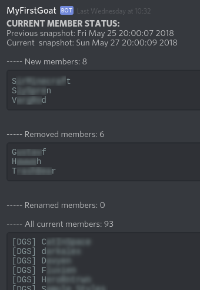
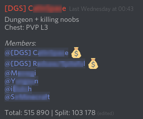
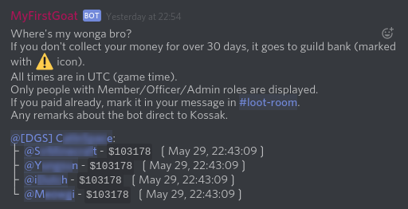

*************
my_first_goat
*************
Discord bot / command line application helping to manage gaming discord server (members and loot messages)

.. contents::

.. section-numbering::

Features
========

Bot can:

+ Display discord server changelog (list of all members and members that are new/removed/renamed),
  which you can use to compare with your guild members in game.
+ Scan loot/money messages from specific channel and summarize who owns who and how much.
+ Search servers/channels/users by their names

Requirements
============

+ Python >= 3.6.5
+ Linux (it should work on Windows, although I haven't tested it there)

Installation
============

Using pip::

    pip install -U git+https://github.com/tkossak/my_first_goat

Setup
-----
Run the bot without any parameters to create sqlite database (for keeping members snapshots) and config file::

    > my_first_goat

    Config data was copied to /home/kossak/.config/my_first_goat/config.toml
    Edit this file and rerun the bot.

Configuration
-------------
Edit the ``config.toml`` file that was created and replace dummy values with proper discord IDs for all the variables
(server / channels / users). All the options are explained in the config file. To find IDs use::

    my_first_goat --search-server <SERVER_NAME>
    my_first_goat --search-channel <CHANNEL_NAME>
    my_first_goat --search-user <USER_NAME>

You don't need to enter full server/channel/user names, part of the names will be searched for too (case insensitive).

Usage
=====

Available options
-----------------
::

    > my_first_goat --help

    Usage: my_first_goat [OPTIONS]

    Discord bot helping to manage gaming discord server (members and loot messages)

    Options:
      --version              Show the version and exit.
      --info                 Display info about configuration/database file
      -l, --loot             Process loot messages and send summary
      -g, --get              Get snapshot of members from discord server and save
                             in the database
      -s, --send             Send comparison between two last member snapshots
      -t, --test             Send test message to debug_user. May be used alone or
                             with -s/-l to send messages only to debug_user
      --search-server TEXT   search for servers containing given phrase
      --search-channel TEXT  search for channel IDs containing given phrase
      --search-user TEXT     display /IDs containing given phrase
      -v, --verbose          Be verbose
      --help                 Show this message and exit.

Test bot token
--------------

Send test message to ``user_debug`` (see config file) by::

    my_first_goat --test

Discord server changelog
------------------------

Use::

    my_first_goat --get

to get snapshot of all discord members with specified role(s) (see config file) and save them in the database.
Get at least two snapshots and then you can send the changelog between last two snapshots (to the user ``user_send``) with::

    my_first_goat --send

(Add ``--test`` option to send this message only to ``user_debug``). The result message contains all new/removed/renamed members as well as list of all members (with given role)
that you can copy (and for example compare with guild members in the game). Sample message:

You can also combine getting the snapshot and sending differences in one command::

    my_first_goat -gs

Loot messages
-------------

Read and summarize all loot messages with::

    my_first_goat --loot

Bot will scan through all messages in ``channel_loot_from_id`` and output summary message to
``channel_loot_to_id`` (add ``--test`` switch to send this message only to ``user_debug``). On your discord server you need to have a channel where people post loot messages, containing
mentions of all party members and (if available) money that is split between party. The message should have format similar to::

    @Member1 @Member2 @Member3 paid @Member4
    total: 1m
    split: 250k

It doesn't need to be exactly in this format, for example you can put spaces or new lines between sections, or you can
add to the message any other text or images you want.
Members with "paid" or ":moneybag:" after their names won't appear in the result message
(it means they have already been paid).
Sample message:

Example of summary message, sent by the bot:

.. _Discord Application: https://discordapp.com/developers/applications/me
